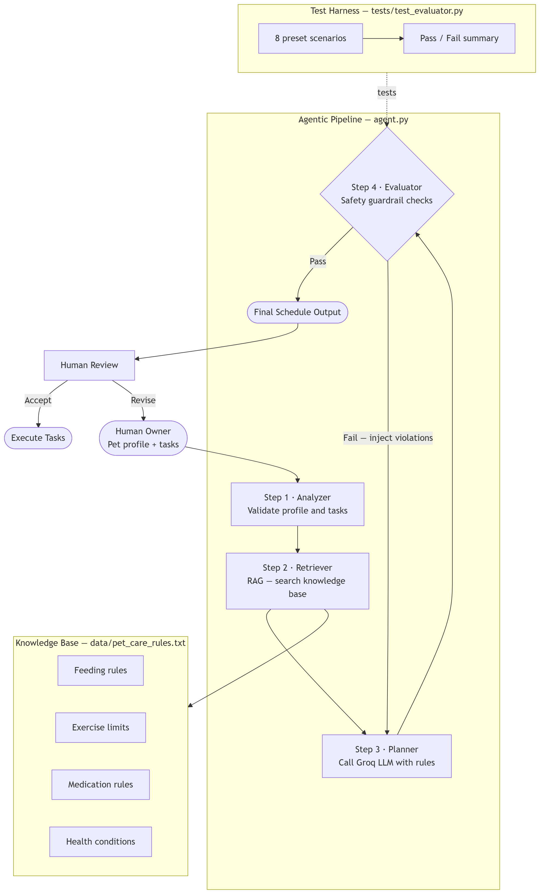

# Applied AI System – Pet Service Scheduler

## 1. Summary

The **Pet Service Scheduler** is an intelligent pet care scheduling system that generates safe, prioritized daily care plans for pets. Originally built as a rule-based task scheduler (Project 2), it was upgraded into a full applied AI system (Project 4) by integrating three core capabilities:

- **Retrieval-Augmented Generation (RAG)** — grounds every schedule in a curated knowledge base of pet care safety rules
- **Agentic Workflow** — a multi-step pipeline that analyzes input, retrieves relevant rules, plans a schedule via LLM, and self-evaluates before outputting
- **Automated Guardrails** — deterministic safety checks that flag or reject schedules violating care constraints

Given a pet's profile (species, breed, age, weight, health conditions), a list of care tasks, and owner-specified priorities, the system produces a validated daily schedule that respects both safety rules and personal preferences.

---

## 2. Original Project Description

The baseline Pet Service Scheduler (Project 2) was a straightforward scheduling tool that:

- Accepted a list of pet care tasks (feeding, walking, grooming, medication, etc.) and owner preferences as input
- Applied simple prioritization logic to arrange tasks into a daily timeline
- Produced a text-based schedule as output

While functional, the original system had significant limitations:
- **No knowledge retrieval** — scheduling decisions were based entirely on hard-coded rules
- **No LLM reasoning** — the system could not adapt to nuanced scenarios like health conditions or conflicting priorities
- **No validation** — there was no mechanism to catch unsafe schedules (e.g., intense exercise for a pet with a heart condition)

The Project 4 upgrade addresses all three gaps.

---

## 3. New AI Features Added

### 3.1 Retrieval-Augmented Generation (RAG)

A curated knowledge base (`data/pet_care_rules.txt`) contains 10–15 veterinary-informed pet care rules covering topics like feeding-exercise spacing, medication timing, breed-specific activity limits, and age-appropriate care. At runtime, the retriever module searches this file and injects only the relevant rules into the LLM prompt — grounding every schedule in domain knowledge rather than relying on the model's general training.

**Why RAG?** It keeps the system accurate and updatable. New rules can be added to the text file without retraining or modifying code.

### 3.2 Agentic Workflow

Instead of a single-pass generation, the system follows a structured multi-step agent loop:

1. **Analyze** — Parse and validate the pet profile and task list (`analyzer.py`)
2. **Retrieve** — Search the knowledge base for rules relevant to this pet (`retriever.py`)
3. **Plan** — Generate a prioritized schedule via LLM using pet info + retrieved rules + owner priorities (`planner.py`)
4. **Evaluate** — Run the proposed schedule through deterministic safety checks (`evaluator.py`)
5. **Decide** — Output the schedule if it passes, or flag violations and re-plan with adjusted constraints

This separation of concerns makes each stage independently testable and debuggable.

### 3.3 Guardrails & Reliability

A deterministic evaluation layer inspects every generated schedule for constraint violations before it reaches the user. Examples of checks include:

- Feeding scheduled too close to vigorous exercise
- Medication doses skipped or misordered
- Activity duration exceeding safe limits for the pet's health conditions
- Tasks scheduled outside reasonable hours

If a violation is detected, the evaluator feeds specific feedback back into the planner for a corrected attempt, up to a maximum retry count.

---

## 4. System Architecture Diagram overview

The system follows a linear pipeline architecture. User input flows into the Analyzer, which validates the pet profile and task list. The validated data passes to the Retriever (RAG module), which searches the knowledge base and attaches relevant safety rules. The Planner then sends a structured prompt — combining pet info, retrieved rules, and owner priorities — to the LLM to generate a schedule. Finally, the Evaluator runs deterministic safety checks on the proposed schedule. If checks pass, the schedule is output to the user. If checks fail, violation feedback loops back to the Planner for re-generation.



---

## 5. Instructions: How to Run the Project

### Prerequisites

- Python 3.10+
- An OpenAI API key (or compatible LLM endpoint)

### Installation

```bash
# Clone the repository
git clone https://github.com/<your-username>/ai-pet-scheduler.git
cd ai-pet-scheduler

# Create and activate a virtual environment
python -m venv venv
source venv/bin/activate        # macOS / Linux
venv\Scripts\activate           # Windows

# Install dependencies
pip install -r requirements.txt

# Set your API key
export OPENAI_API_KEY="your-key-here"       # macOS / Linux
set OPENAI_API_KEY=your-key-here             # Windows

#Run the Scheduler
python main.py

#Run Tests
python -m pytest test_scheduler.py -v

## 6. Example Inputs/Outputs
Input:
Example 1 — Standard Dog Schedule (All Checks Pass)
Pet: Bella — 3-year-old Golden Retriever, 65 lbs, mild hip dysplasia
Tasks: morning walk, breakfast, medication, afternoon play, dinner, evening walk
Priorities: medication before meals, no exercise within 30 min of eating

Output:
Daily Schedule for Bella (Golden Retriever, 3 yrs)
───────────────────────────────────────
  7:00 AM   Medication
  7:30 AM   Breakfast
  8:15 AM   Morning walk (moderate pace — hip dysplasia noted)
 12:30 PM   Afternoon play (low-impact activities recommended)
  5:30 PM   Dinner
  6:15 PM   Evening walk (shorter duration recommended)
───────────────────────────────────────
Schedule passed all safety checks.
Rules applied: exercise spacing, medication timing, hip dysplasia activity limits

Example 2: Guardrail Triggered (Unsafe--> Re-planned)
Input:
Pet: Max — 10-year-old Bulldog, 50 lbs, heart condition
Tasks: 1-hour run, breakfast, medication
Priorities: exercise first thing

Output:
Schedule flagged by safety evaluator:
  - VIOLATION: 1-hour run exceeds safe activity duration for a dog
    with a heart condition
  - RECOMMENDATION: Reduce to 15-20 min gentle walk;
    consult veterinarian for exercise plan

Re-generating schedule with adjusted constraints...

Revised Schedule for Max (Bulldog, 10 yrs)
───────────────────────────────────────
  7:00 AM   Medication
  7:30 AM   Breakfast
  8:15 AM   Gentle walk (15 min — heart condition limit applied)
───────────────────────────────────────
Revised schedule passed all safety checks.

Example 3 — Senior Cat with Age-Specific Rules

Input:
Pet: Whiskers — 14-year-old Persian cat, 9 lbs, arthritis
Tasks: breakfast, medication, gentle play, grooming, dinner
Priorities: keep play sessions short, medication with meals

Output:
Daily Schedule for Whiskers (Persian, 14 yrs)
───────────────────────────────────────
  7:30 AM   Breakfast + Medication (administered with food)
 10:00 AM   Gentle play (10 min max — arthritis noted)
  2:00 PM   Grooming (gentle brushing, low-stress positioning)
  6:00 PM   Dinner + Medication (administered with food)
───────────────────────────────────────
Schedule passed all safety checks.
Rules applied: senior cat activity limits, medication-meal pairing,
arthritis-safe handling, play duration cap


## 7. Design Decisions

| Decision | Why I Built It This Way | Trade-off |
|---|---|---|
| Plain text file for RAG knowledge base | A simple .txt file is transparent, easy to edit, and needs no database setup. For 10–15 rules, this is sufficient and keeps the project approachable. | Does not scale well to hundreds of rules. A vector database would be better for a larger knowledge base. |
| Deterministic evaluator instead of LLM-based evaluation | Safety checks must be reliable and reproducible. A rule-based evaluator always gives the same result for the same input. | Less flexible — adding new check types requires code changes rather than prompt updates. |
| Multi-step agent pipeline instead of single-pass generation | Separating analysis, retrieval, planning, and evaluation makes each component independently testable and debuggable. | More complex to implement and slightly slower than a single LLM call. |
| Re-planning loop on guardrail failure | Instead of rejecting an unsafe schedule, the system feeds violations back to the planner for self-correction. Better user experience. | Needs a max retry count to prevent infinite loops when priorities conflict with safety rules. |
| Owner priorities injected directly into LLM prompt | Clearly labeled sections for safety rules vs. owner preferences help the model respect both without confusion. | Prompt length grows with more priorities, which could hit token limits for complex requests. |


## 8. Testing Summary

| Test Category | What It Validates | Type |
| --- | --- | --- |
| Input parsing | Pet info and task list are correctly parsed and validated | Unit |
| Rule retrieval | Correct rules are retrieved for given pet profiles | Unit |
| Schedule structure | Generated schedules contain all requested tasks in valid time slots | Integration |
| Guardrail enforcement | Unsafe schedules are correctly flagged (e.g., exercise + heart condition) | Unit |
| End-to-end pipeline | Full input → analysis → retrieval → planning → evaluation → output | Integration |
| Edge cases | Empty task lists, unknown species, conflicting priorities | Unit |

What Worked
Guardrail tests were the most reliable. Because the evaluator is deterministic, these tests consistently passed and caught real issues. They served as a safety net during development — whenever I changed the planner prompt, the guardrail tests immediately flagged if the new output violated a constraint.

Modular architecture made unit testing straightforward. Each module has a clear input/output contract, so testing the retriever or analyzer in isolation required no mocking of the LLM.

What Didn't Work (At First)
LLM output was initially inconsistent in format. Early integration tests failed because the planner sometimes returned schedules in slightly different formats (e.g., "7:00am" vs. "7:00 AM"). I had to add output normalization in utils.py to handle variations before the evaluator could parse them reliably.

Edge case with conflicting priorities was hard to test. When owner priorities directly contradicted safety rules (e.g., "exercise immediately after eating"), the re-planning loop initially ran indefinitely. Adding a retry cap and testing that specific scenario fixed the issue.

What I Learned
Deterministic tests are essential when working with LLMs — you need at least one layer of the system that behaves predictably to anchor your testing against.

Testing the full pipeline end-to-end uncovered integration issues that unit tests alone would have missed, especially around data format mismatches between modules.

## 9. Reflection

### What This Project Taught Me About AI

Reliable AI is as much about the scaffolding around the model as the model itself. The LLM generates creative, context-aware schedules, but without retrieval to ground it and guardrails to validate it, the system would not be trustworthy. The biggest improvements came from better architecture, not better prompts.

### What This Project Taught Me About Problem-Solving

- **Start with the failure modes.** Designing the evaluator first forced me to define what "correct" looks like, which made every subsequent decision easier.
- **Separation of concerns pays off.** The modular pipeline took more time to set up, but made debugging fast — I could isolate issues to retrieval, planning, or evaluation within minutes.
- **Prompt engineering is iterative.** Getting the LLM to respect both safety rules and owner priorities took several rounds of experimentation. The key was using clearly labeled sections in the prompt instead of mixing instructions together.

## Future: If I Had More Time

Expand the knowledge base to support cats, birds, and reptiles with species-specific rule sets

Replace keyword-based retrieval with embedding-based vector search for more nuanced rule matching

Add a Streamlit front-end for interactive scheduling

Support multi-day and recurring schedule generation


